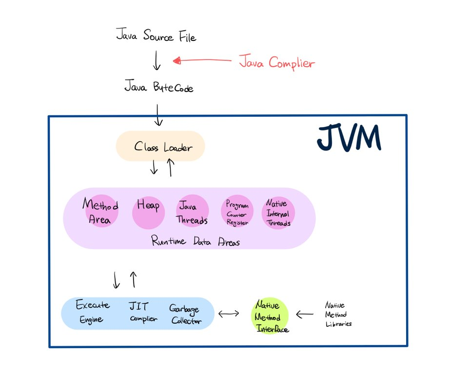

### 목표

자바 소스 파일(.java)을 JVM으로 실행하는 과정 이해하기.

### 학습할 것
1. JVM이란 무엇인가
2. 컴파일 하는 방법
3. 실행하는 방법
4. 바이트코드란 무엇인가
5. JIT 컴파일러란 무엇이며 어떻게 동작하는지
6. JVM 구성 요소
7. JDK와 JRE의 차이

<hr>

### 1. JVM(Java Virtual Machine)이란 무엇인가

**java 프로그램을 실행할 수 있도록 해주는 가상 머신**으로,
자바로 쓰여진 프로그램은 컴퓨터가 바로 이해할수 있는 기계어로 작성된 것이 아니기 때문에 코드를 변환하는 과정이 필요하다.
이러한 처리를 해주는 것이 JVM이다.

운영체제별로 프로그램을 실행하고 관리하는 방법이 다르기 때문에 운영체제별로 자바 프로그램을 별도로 개발하는 것보다
운영체제와 자바 프로그램을 중계하는 JVM을 두어 자바 프로그램이 여러 운영체제에서 동일한 실행 결과가 나올수 있도록 설계한 것이다
이로인해 개발자는 운영체제와 상관없이 자바 프로그램을 개발할수 있고, 자바는 ***Write Once, Run Anywhere***(한번 작성하면 어디서든지 실행가능)한 언어이다!    
: 자바는 OS에 독립적! JVM은 OS에 종속적!
    
### 2. 컴파일 하는 방법

컴파일이란 사람이 이해하는 언어를 컴퓨터가 이해할 수 있는 언어로 바꿔주는 과정을 말하며(원시코드 -> 목적파일)
자바는 컴파일 과정을 거치게되면 .class의 형태의 바이트코드로 변환된다.

메모장에   
```java
public class WS_live_study {
  public static void main(String[] args) {
	  System.out.println("Hello, Java");
  }	
}
```
라고 입력후 .java 확장자로 저장한다.

cmd창을 연후 저장한 .java파일이 있는 위치로 이동한다.<br>
설치한 java jdk를 이용하여 javac명령어로 .java파일을 컴파일 한다.
> javac.exe : 자바 컴파일러, 자바로 작성된 소스코드를 바이트 코드로 변환
```
>javac WS_live_study.java
```

이 명령어를 실행하고 나면 .java파일 위치에 class파일이 되는것을 볼수있다!    
```
2021-02-07  오후 01:08               431 WS_live_study.class
2021-02-07  오후 01:08               120 WS_live_study.java
```
.class파일은 javap -c [파일명]으로 볼수 있다.

```cmd
>javap -c WS_live_study.class
Compiled from "WS_live_study.java"
public class WS_live_study {
  public WS_live_study();
    Code:
       0: aload_0
       1: invokespecial #1                  // Method java/lang/Object."<init>":()V
       4: return

  public static void main(java.lang.String[]);
    Code:
       0: getstatic     #2                  // Field java/lang/System.out:Ljava/io/PrintStream;
       3: ldc           #3                  // String Hello, Java
       5: invokevirtual #4                  // Method java/io/PrintStream.println:(Ljava/lang/String;)V
       8: return
}
```
	Code 라고 써져있는 부분이 opcode이다

> 실행하는 자바 버전이 컴파일한 자바 버전보다 낮은 경우,  <> 오류가 발생한다
> 따라서 컴파일 할 때 특정버전을 지정하여 컴파일이 가능하다


### 3. 실행 하는 방법
.class파일을 실행하는 방법은 java명령어로 실행하면 된다.
***이때 파일 확장자는 빼고 입력한다!***    
> java.exe : 자바 인터프리터, 바이트코드를 실행한다.
```cmd
>java WhiteShip_1week

>java WS_live_study
Hello, Java
```

### 4. 바이트코드란 무엇인가

java에서 .class로 컴파일 된 소스파일은 바이트코드로 되어있다. 명령어의 크기가 1byte라 바이트코드라 불린다.
1byte는 2^8 256개의 값이 있는 256개가량의 opcode들이 존재한다.
이는 가상머신이 이해할 수 있는 코드이며 JVM이 이 코드를 컴퓨터가 읽을 수 있는 기계어로 번역하여 JAVA프로그램을 실행 할 수 있는 것이다.

#### 4.1 바이너리코드, 기계어란
바이너리코드 : 0,1 이진 숫자로 이루어진 코드를 말한다.

기계어 : 컴퓨터가 이해할 수 있는 0,1로 이루어진 바이너리 코드이다.

기계어가 바이너리코드로 이루어져있을 뿐, **모든 이진코드가 기계어인 것은 아니다**!!
<i>(바이너리코드 != 기계어)</i>
    
### 5. JIT 컴파일러란 무엇이며 어떻게 동작하는지
Just-In-Time의 약자로 그때그때 기계어로 컴파일을 해준다.
javac와는 상관 없으며 .class파일을 실행할 때 관여한다.

인터프리터 방식으로 한줄씩 컴파일하며, 자주사용하는 메소드를 JIT컴파일러가 번역한 바이트코드를 캐싱하여 메모리에 올려두면
같은 코드를 컴파일 하게 될 경우 캐싱해놓은 것을 꺼내와 전달해주기 때문에 보다 빠르게 기계어 번역이 가능하다.
<br><br>
JIT도 하나의 스레드이며 .java파일 컴파일 시 인터프리터와 JIT컴파일러가 같이 동작한다!
    
### 6. JVM 구성 요소

    
#### 6.1 Class Loader
컴파일된 바이트코드를 읽어 들여서 메모리(Runtime Data Areas)에 적재한다.	
로드하는 시점은 ComplieTime이 아닌 **RunTime**

#### 6.2 Run Time Area
프로그램을 수행하기 위해 운영체제로부터 할당 받는 JVM의 메모리 영역을 말한다.

	6.2.1 Method Area
	class데이터를 위한 공간으로
	class의 Method같은 클래스의 데이터를, class의 메타정보(Field,  Field타입, Class이름..)를 저장한다.
	
	6.2.2 Heap
	new 연산으로 생성된 객체, 배열, 변수 등의 정보가 저장된다.
	레퍼런스 변수의 경우 Heap에 인스턴스가 저장되는 것이 아니라 포인터가 저장된다.
	
	6.2.3 Java Threads
	JVM에 의해 스케쥴되는 실행 단위의 코드 블럭을 말한다.
	
	6.2.4 Program Counter Register
	Thread가 시작될때마다 생성되며 스레드마다 하나씩 가지고 있다. 현재 수행 중인 JVM명령어의 주소를 가지고있다.
	
	6.2.5 Native Internal Threads
	

#### 6.3 Execute Engine
.java 파일이 .class파일로 컴파일 되며,    
Class Loader를 통해 JVM내의 Runtime Data Areas에 적재된 바이트코드를 명령어 단위로 실행한다.

	6.3.1 JIT complier(+ Interpreter)
	내부적으로 얼마나 자주 수행되는지 체크하고 일정 수준을 넘겼을시 동작한다.

	6.3.2 Garbage Collector
	Java는 C언어와 다르게 JVM이 객체를 하는데, 아래와 같은 경우에 그 대상이 된다.

	- 객체가 null인 경우
	- 블럭 안에 생성되어 블럭 실행 종료된 경우
	- 부모 객체가 null인 자식 객체인 경우

    
### 7. JDK와 JRE의 차이
JDK (Java Developement kit) => java 개발을 위한 키트로 JRE외에 추가 개발에 필요한 도구가 들어있음.
JRE (Java Run Environment) => java실행을 위한 환경만 제공

##### 📚 참고
  이것이 자바다<br>
  <https://mattlee.tistory.com/89><br>
  <https://as-i-am-programing.tistory.com/2><br>
  <https://sehun-kim.github.io/sehun/JVM/><br>
